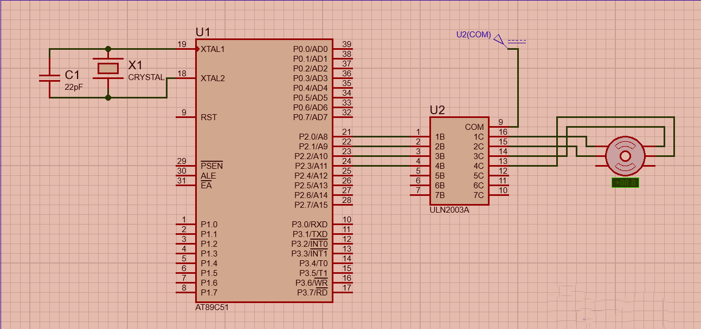

# Stepper Motor Interfacing with 8051 Microcontroller

This project demonstrates the interfacing of a stepper motor with an 8051 microcontroller.
The motor is controlled in both clockwise and counterclockwise directions using a half-step sequence.

## Project Overview
  - Microcontroller: 8051 (AT89C51)
  - Software: Keil for Embedded C code, Proteus for simulation
  - Purpose: Rotate a stepper motor in both directions with precise control.

### Features
  
  -  Clockwise and Counterclockwise Rotation: The stepper motor rotates clockwise and counterclockwise with a half-step sequence for smooth motion.
  - Delay Mechanism: Adjustable delays control rotation speed.

### Components Used
- 1] AT89C51 Microcontroller
- 2]ULN2003 Driver IC (or equivalent) to control the stepper motor
- 3]Stepper Motor
- 4]Supporting Components: Resistors, capacitors, and crystal oscillator

### Circuit Design
  - Port P2 of the microcontroller is connected to the ULN2003 driver, which drives the stepper motor.
  - Power supply connections are made to support both the microcontroller and the motor driver.
    
### Schematic and PCB
  - The Proteus schematic includes connections between the 8051 microcontroller, ULN2003 driver, and stepper motor.
  - The PCB design includes routing for stable operation, and a 3D view is provided for reference.
   

### Code Explanation
The code includes functions for:

- 1]Stepper_CW: Rotates the motor clockwise.
- 2]Stepper_CCW: Rotates the motor counterclockwise.
- 3]Delay: Provides adjustable delay times for controlling the motor speed.

### Simulation
  - The Proteus simulation file shows the motor rotation in both directions, confirming proper functionality.

#### Installation and Usage
  - Open the code in Keil and load it onto the microcontroller.
  - Run the Proteus simulation to visualize the motor's rotation.
  - For PCB manufacturing, refer to the included PCB design and 3D view for hardware implementation.
